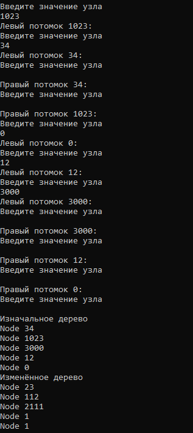
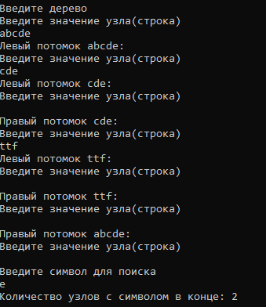

# Радостев Павел ИТС-2 Лабораторная №4

# Задание 1

## Задача 1

### Текст задачи

Дерево содержит целые числа. Вычесть из каждого разряда числа 1, если разряд не содержит 0, иначе заменить этот разряд на 1. Например, 1024 → 113

### Алгоритм решения

1. Запросить ввод дерева у пользователя
2. Пройти по каждому значению дерева, применяя функцию изменения значения (Вычесть из разряда чисал 1, если не содержит 0, иначе заменить этот разряд на 1)
3. Вывести изменённое функцией дерево

### Тестирование

# Задание 2

## Задача 1

### Текст задачи

Дерево содержит строки. Сколько узлов дерева заканчивается на заданный символ?

### Алгоритм решения

1. Запросить ввод каталога у пользователя
2. Найти все файлы каталога и подкаталогов в виде массива
3. Получить расширения каждого файла
4. Сгруппировать расширения
5. Указать у каждой группы расширений количество сгруппированных расширений
6. Найти группу расширений по минимальной длине
7. Вывести ответ

### Тестирование

